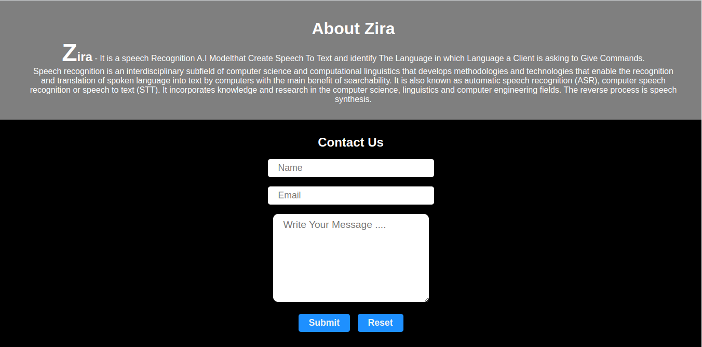

# Zira - Responsive Speech to Text Recognition Website

Welcome to Zira, a responsive speech to text recognition website built using HTML and CSS.

## Description

Zira is an innovative web application that allows users to convert spoken words into text with ease. With its intuitive interface, users can simply speak into their device's microphone, and Zira will transcribe the speech into text in real-time. The website is designed to be responsive, providing an optimal user experience across various devices, including desktops, tablets, and mobile phones.

## Features

- Real-time speech to text conversion
- Responsive design for seamless usage on different devices
- Intuitive and user-friendly interface

## Screenshots



Include screenshots or GIFs showcasing the website's user interface and features.

## Usage

1. Clone the repository:

```bash
git clone https://github.com/your-username/zira.git
